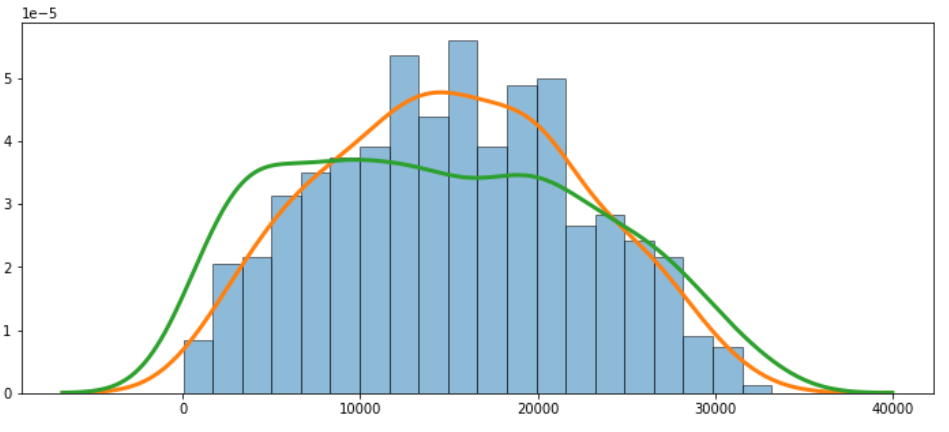
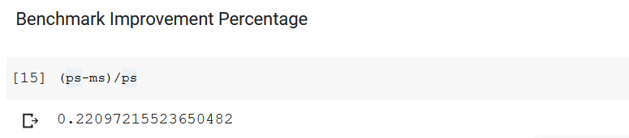
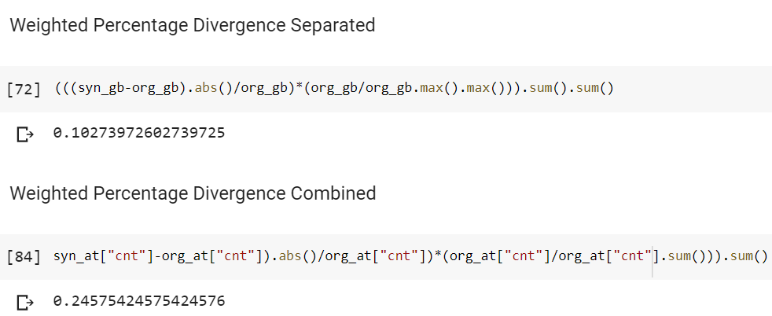

# Similarity

Symbols:
-  BK - Banking
-  LC - Lending & Credit
-  IR - Individuals Reference Data
-  ER - Entities Reference Data
-  TC - Telecommunications Data
-  DD - Device Data

Index:
- [KDE Similarity Metric](#kde)
- [Correlation Matrix Distance Score](#correlation)
- [Count Distribution Divergence](#count)

-----------------

<a name="kde"></a>

### KDE Similarity Metric [[code](https://github.com/datasprint/evaluation-metrics/blob/master/similarity/kde-curve-similarity.py), notebook]
**Applicable:**

BK, LC, IR, ER

**Explanation:**

Kernel Density Estimation (KDE) is a way of obtaining an estimated probability density function from a random variable. The curves of two KDE plots can be compared with one another. There are a few metrics that can be used to compare curves. Among others you one can use the curve length difference, partial curve mapping, discrete Frechet distance, dynamic time warping, and the area between curves. This technique would work with any other curves, like ROCAUC curves, or cumulative sum curves. *This method basically compares two distributions with one another.* The most realistic looking feature would have the lowest distance (metric).

**Output:**

```
{'Area Between Curves': 0.60937,
 'Curve Length Difference': 25.05818,
 'Discrete Frechet Distance': 2.04475,
 'Dynamic Time Warping': 210.27023,
 'Mean Absolute Difference': 0.52755,
 'Partial Curve Mapping': 157.43363}
 ```

**Visualisation:**



<a name="correlation"></a>

### Correlation Matrix Distance Score [[code](https://github.com/datasprint/evaluation-metrics/blob/master/similarity/correlation-matrix-distance-score.py), notebook]
**Applicable:**

BK, LC, IR, ER

**Explanation:**

This is a simple metric that calculates the correlation matrix of the orignal and the synthetic dataset. The synthetic correlation matrix is deducted from the original correlation matrix to obtain the absolute sum. This is called the modelling score. The modelling score is compared against a random permuation of the synthetic sample called the permuation score after which a ratio is obtained to identify how much better the correlation matrix of the synthetic dataset is compared to a random correlation matrix benchmark. This is reported as the Benchmark Improvement Percentage.

**Output:**



**Visualisation:**


<a name="count"></a>

### Count Distribution Divergence [[code](https://github.com/datasprint/evaluation-metrics/blob/master/similarity/count-distribution-divergence.py), notebook]
**Applicable:**

BK, LC, IR, ER

**Explanation:**

This is essentially a group-by function that sum's the values of discrete features. The weighted percentage deviation is calculated to identify how dfferent the synthetic dataset is to the original dataset. 

**Output:**



**Visualisation:**


